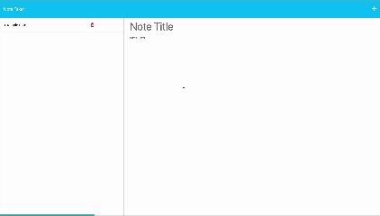

# Interactive Note-Taking App

## Introduction 📚

The Interactive Note-Taking App is designed to provide an efficient way to jot down and manage your notes. This guide will detail the objectives, features, and implementation process behind the app.

## Project Overview 🌐

The Interactive Note-Taking App aims to offer users a simple, yet effective, way to capture their thoughts, tasks, or any textual information, with the added features of note editing and deletion.

### Objectives 🎯

- Deliver a user-friendly interface.
- Provide note creation, editing, and deletion capabilities.
- Focus on mobile-readiness and overall user experience.

## Features 📝

- Create new notes
- Edit existing notes
- Delete unwanted notes

## Development Process 💻

### Step 1: Requirement Analysis

User requirements include:
- Mobile-friendly design.
- Efficient note management.

### Step 2: Designing the Algorithm

1. Initialize note-taking interface.
2. Implement note CRUD (Create, Read, Update, Delete) operations.

### Step 3: Coding the Solution

Key functions include:

- **`getNotes`:** Fetches existing notes.
- **`saveNote`:** Saves a new note.
- **`deleteNote`:** Deletes an existing note.

### Step 4: Testing & Debugging

Thorough testing is performed to ensure robustness and reliability. Debugging is carried out for any identified issues.

### Step 5: User Interface Design

A responsive and clean interface has been created to enhance user experience.

## Code Breakdown 🧠

### Main Function: `handleNoteSave`

- **Note Initialization:** Creates a new note.
- **Note Saving:** Saves the note.
- **Note Management:** Manages the created notes.

### Event Handling

- **Button Clicks:** Listeners for creating, saving, editing, and deleting notes.

## How to Use the Project 🖥️

- Clone the repository
- open terminal 
- run npm i to update all the required dependencies 
- open the HTML file in a browser, and start taking notes as needed.

## Conclusion 🏁

This Note-Taking App serves as an efficient platform for managing textual information. Feel free to explore and contribute to the codebase.

## Repository
https://github.com/MrSep01/note_taking_App

## Live Demo 🌐
A live demo of the project can be accessed [here](https://interactive-note-taking-app-3f98291bce84.herokuapp.com/).

## APP Screen shot 🖼️

## License & Contribution 📜

This project is open for contributions and is licensed under the MIT License.

## Contact 📞

For inquiries, please contact sep.alamouti@sepalamouti.com
